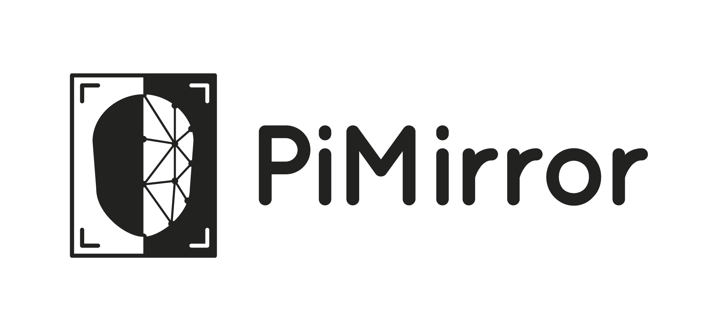

# PiMirror

PiMirror is a Raspberry Pi operated Smart Mirror with an accompanying Android application. An attached USB webcam allows for the utilisation of facial recognition to switch between designated user profiles. PiMirror is comprised of a monitor behind two-way glass, allowing for the interface to be shown through the mirror, as well as the mirror image itself. The interface can be used to display numerous modules of the user’s preference. These modules include: 5-day Weather Forecast; Dublin Bus Real-Time Information; Cryptocurrency stock price tracking; Gmail inbox; Google Calendar events; and a scrolling News Ticker. The profiles allow the interface of the mirror to change to each user’s pre-set module configuration, which are established from the Android app.

## Who is the target audience?

This project is designed for everyday people in a household. It is intended to help ease their daily routine, and provide them with information that they require everyday.

## This project
This Repo has been established in order to document the development process of the above described application, as part of the CA400 final year project. 
